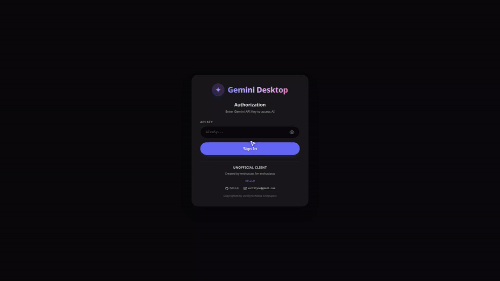

<div align="center">
  


# Gemini Desktop

**An unofficial, lightweight, privacy-focused desktop client for Google Gemini API.**
Built with Go, Wails v2, SQLite, and Vanilla JS.

[](https://github.com/vortifyne/gemini-desktop/releases)
[](https://golang.org)
[](LICENSE)

</div>

---

## Highlights

- **Local-First & Private**: Your prompts, history, and API keys remain strictly on your local machine.
- **Developer-Grade Code Rendering**: Syntax highlighting for 100+ languages (Highlight.js) with line numbers, copy buttons, and raw text toggles.
- **Internationalization (i18n)**: Out-of-the-box support for **13 languages** with instant live switching.
-  **Deep Customization**: Multiple UI accent color themes, code editor themes, and fluid scale controls.
-  **Rich QoL Features**: Keyboard shortcuts, local Mock Mode for testing, chat exports (`.md` / `.json`), chat tagging with custom HUE colors, bookmarks, and per-chat draft saving.

---

## Preview

<p align="center">
  
</p>

---

## Keyboard Shortcuts

| Shortcut | Action |
| :--- | :--- |
| `Ctrl + N` / `Cmd + N` | Create a new chat |
| `Ctrl + F` / `Cmd + F` | Focus search chats input |
| `Ctrl + \` | Toggle sidebar visibility |
| `Ctrl + M` | Toggle Mock Mode |
| `Ctrl + E` | Open Chat Export modal |
| `Esc` | Close modals / clear search focus |

---

## Installation & Build

### Prerequisites
- [Go 1.25+](https://golang.org/dl/)
- [Node.js 18+](https://nodejs.org/)
- [Wails v2 CLI](https://wails.io/docs/gettingstarted/installation) (`go install github.com/wailsapp/wails/v2/cmd/wails@latest`)
- **Linux Dependencies** (Fedora):
  ```bash
  sudo dnf install gcc-c++ gtk3-devel webkit2gtk4.1-devel mingw64-gcc make
  ```

### Building from Source

1. Clone the repository:
```bash
git clone https://github.com/vortifyne/gemini-desktop.git
cd gemini-desktop
```

2. Build for Linux:
```bash
make build
# Binary location: build/bin/gemini-desktop
```

3. Cross-compile `.exe` for Windows (from Linux):
```bash
wails build -platform windows/amd64
# Binary location: build/bin/Gemini Desktop.exe
```
